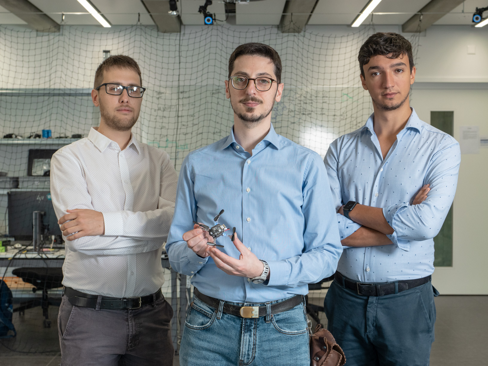

<link rel="stylesheet" href="//maxcdn.bootstrapcdn.com/font-awesome/4.3.0/css/font-awesome.min.css">
<link rel="stylesheet" href="//cdn.rawgit.com/jpswalsh/academicons/master/css/academicons.min.css">
<link rel="stylesheet" href="{{'/assets/css/flickity.css'| relative_url }}">
<link rel="stylesheet" href="{{'/assets/css/csl-blocks.css'| relative_url }}">

# About

<figure style="width: 30%" class="group-photo align-right"></figure>
The nanorobotics research group at IDSIA focuses its scientific effort on improving the onboard intelligence of ultra-constrained miniaturized robotic platforms aiming at the same capability as biological systems.
By leveraging Artificial Intelligence-based (AI) algorithms, some of the research areas encompass optimized ultra-low power embedded Cyber-Physical Systems (CPS), deep learning models for energy-efficient perception pipelines, multi-modal ultra-low power sensor fusion, Human-Robot Interaction (HRI) applications, and Cyber-secure systems for Microcontroller Units-class (MCUs).

Thanks to the close partnership with Parallelel Ultra-low Power international research project ([PULP Platform](https://pulp-platform.org/)), the nanorobotics group at IDSIA boasts strong collaborations with the ETH Zürich, the University of Bologna, and the Polytechnic University of Torino.

# People



# News

<figure style="width: 30%" class="align-right"></figure>
## Jan 19, 2024
We contributed to the novel paper "A Heterogeneous RISC-V based SoC for Secure Nano-UAV Navigation," just accepted at the IEEE Transactions on Circuits and Systems I [arXiv preprint](https://arxiv.org/abs/2401.03531).

<figure style="width: 30%" class="align-left"></figure>
## Dec 15 2023
Our new paper “A Sim-to-Real Deep Learning-based Framework for Autonomous Nano-drone Racing” has just been accepted for publication in IEEE Robotics and Automation Letters (RA-L) [arXiv preprint](https://arxiv.org/abs/2312.08991) [video](https://youtu.be/vHTAwUsj-nk).
This work describes our autonomous navigation and obstacle avoidance system for palm-sized quadrotors, developed in collaboration with Università di Bologna and TII Abu Dhabi and winner of the 1st Nanocopter AI Challenge at [IMAV 2022, Delft, Netherlands](https://www.imavs.org/2022/index.html).

## Sep 25 2023
Our paper “Secure Deep Learning-based Distributed Intelligence on Pocket-sized Drones” received the Best Paper Award at the 2nd Workshop on Security and Privacy in Connected Embedded Systems (SPICES) during the ACM EWSN’23 conference in Rende, Italy, 25-27 September 2023.
Our work proposes a secure computational paradigm for deep learning workloads that allows resource-constrained devices, such as nano-drones, to take advantage of powerful remote computation nodes while preserving security against external attackers.

## Jun 29, 2023
Our new paper, "Secure Deep Learning-based Distributed Intelligence on Pocket-sized Drones," has just been accepted at [ACM EWSN'23](https://events.dimes.unical.it/ewsn2023/). [arXiv preprint](https://arxiv.org/abs/2307.01559) [demo-video](https://youtu.be/QwTiigAs4cA).

<figure style="width: 30%" class="align-left"></figure>
## Jun 21, 2023
Our new paper, "Sim-to-Real Vision-depth Fusion CNNs for Robust Pose Estimation Aboard Autonomous Nano-quadcopters," has just been accepted at [IEEE IROS'23](https://ieee-iros.org/). [arXiv preprint](https://arxiv.org/abs/2308.01833) [demo-video](https://youtu.be/p4s2j0_6828).

<figure style="width: 30%" class="align-right"></figure>
## May 4, 2023
We contributed to the novel paper "Shaheen: An Open, Secure, and Scalable RV64 SoC for Autonomous Nano-UAVs," just accepted at [HotChips'23](https://hotchips.org/).

<figure style="width: 30%" class="align-left"></figure>
## Jan 20, 2023
We contributed to the novel paper "Cyber Security aboard Micro Aerial Vehicles: An OpenTitan-based Visual Communication Use Case," just accepted at [IEEE ISCAS'23](https://iscas2023.org/). [arXiv preprint](https://arxiv.org/abs/2303.16554) [demo-video](https://youtu.be/TClcuUWJe0U).

<figure style="width: 30%" class="align-right"></figure>
## Jan 17, 2023
Two new papers have just been accepted at [IEEE ICRA'23](https://www.icra2023.org/). "Deep Neural Network Architecture Search for Accurate Visual Pose Estimation aboard Nano-UAVs," [arXiv preprint](https://arxiv.org/abs/2303.01931) [demo-video](https://youtu.be/dVCScckvcg8) and "Ultra-low Power Deep Learning-based Monocular Relative Localization Onboard Nano-quadrotors" [arXiv preprint](https://arxiv.org/abs/2303.01940) [demo-video](https://youtu.be/pUGL1qu3Z1k).

# Publications

## A Heterogeneous RISC-V based SoC for Secure Nano-UAV Navigation
L. Valente, A. Nadalini, A. Veeran, M. Sinigaglia, B. Sa, N. Wistoff, Y. Tortorella, S. Benatti, R. Psiakis, A. Kulmala, B. Mohammad, S. Pinto, D. Palossi, L. Benini, and D. Rossi 
_in IEEE Transactions on Circuits and Systems I: Regular Papers (TCAS), 2024_

  <a href="{{'/assets/pdf/2024_tcas_hetero.pdf'| relative_url }}">
    

  </a>
<!-- 
  <a href="https://ieeexplore.ieee.org/abstract/document/9600024">
    

  </a>
-->
  <a href="https://arxiv.org/abs/2401.03531">
    

  </a>
  

  <input type="checkbox" id="valente2024hetero-show" />
  
<label class="csl-label" for="valente2024hetero-show"></label>

  

<!-- careful, whitespace inside <pre> appears as-is on the page -->
<pre>@inproceedings{valente2024hetero,
  title={A Heterogeneous RISC-V based SoC for Secure Nano-UAV Navigation}, 
  author={Luca Valente and Alessandro Nadalini and Asif Veeran and Mattia Sinigaglia and Bruno Sa and Nils Wistoff and Yvan Tortorella and Simone Benatti and Rafail Psiakis and Ari Kulmala and Baker Mohammad and Sandro Pinto and Daniele Palossi and Luca Benini and Davide Rossi},
  year={2024},
  eprint={2401.03531},
  archivePrefix={arXiv},
  primaryClass={cs.AR}
}</pre>
  

  

    
Abstract

    

    The rapid advancement of energy-efficient parallel ultra-low-power (ULP) microcontroller units (MCUs) is enabling the development of autonomous nano-sized unmanned aerial vehicles (nano-UAVs). These sub-10cm drones represent the next generation of unobtrusive robotic helpers and ubiquitous smart sensors. However, nano-UAVs face significant power and payload constraints while requiring advanced computing capabilities akin to standard drones, including real-time Machine Learning (ML) performance and the safe co-existence of general-purpose and real-time OSs. Although some advanced parallel ULP MCUs offer the necessary ML computing capabilities within the prescribed power limits, they rely on small main memories (<1MB) and microcontroller-class CPUs with no virtualization or security features, and hence only support simple bare-metal runtimes. In this work, we present Shaheen, a 9mm2 200mW SoC implemented in 22nm FDX technology. Differently from state-of-the-art MCUs, Shaheen integrates a Linux-capable RV64 core, compliant with the v1.0 ratified Hypervisor extension and equipped with timing channel protection, along with a low-cost and low-power memory controller exposing up to 512MB of off-chip low-cost low-power HyperRAM directly to the CPU. At the same time, it integrates a fully programmable energy- and area-efficient multi-core cluster of RV32 cores optimized for general-purpose DSP as well as reduced- and mixed-precision ML. To the best of the authors' knowledge, it is the first silicon prototype of a ULP SoC coupling the RV64 and RV32 cores in a heterogeneous host+accelerator architecture fully based on the RISC-V ISA. We demonstrate the capabilities of the proposed SoC on a wide range of benchmarks relevant to nano-UAV applications. The cluster can deliver up to 90GOp/s and up to 1.8TOp/s/W on 2-bit integer kernels and up to 7.9GFLOp/s and up to 150GFLOp/s/W on 16-bit FP kernels.
    

  

## A Sim-to-Real Deep Learning-based Framework for Autonomous Nano-drone Racing
L. Lamberti, E. Cereda, G. Abbate, L. Bellone, V. J. Kartsch Morinigo, M. Barcis, A. Barcis, A. Giusti, F. Conti, and D. Palossi 
_in IEEE Robotics and Automation Letters (RA-L), 2024_

  <a href="{{'/assets/pdf/2023_ral_imav.pdf'| relative_url }}">
    

  </a>
  <a href="https://ieeexplore.ieee.org/abstract/document/10380668">
    

  </a>
  <a href="https://arxiv.org/abs/2312.08991">
    

  </a>
  

  <input type="checkbox" id="lamberti2024imav-show" />
  
<label class="csl-label" for="lamberti2024imav-show"></label>

  

<!-- careful, whitespace inside <pre> appears as-is on the page -->
<pre>@misc{lamberti2024imav,
      author={Lamberti, Lorenzo and Cereda, Elia and Abbate, Gabriele and Bellone, Lorenzo and Morinigo, Victor Javier Kartsch and Barciś, Michał and Barciś, Agata and Giusti, Alessandro and Conti, Francesco and Palossi, Daniele},
      journal={IEEE Robotics and Automation Letters}, 
      title={A Sim-to-Real Deep Learning-Based Framework for Autonomous Nano-Drone Racing}, 
      year={2024},
      volume={9},
      number={2},
      pages={1899-1906},
      doi={10.1109/LRA.2024.3349814}}
}</pre>
  

  

    
Abstract

    

    Autonomous drone racing competitions are a proxy to improve unmanned aerial vehicles' perception, planning, and control skills. The recent emergence of autonomous nano-sized drone racing imposes new challenges, as their ~10cm form factor heavily restricts the resources available onboard, including memory, computation, and sensors. This paper describes the methodology and technical implementation of the system winning the first autonomous nano-drone racing international competition: the IMAV 2022 Nanocopter AI Challenge. We developed a fully onboard deep learning approach for visual navigation trained only on simulation images to achieve this goal. Our approach includes a convolutional neural network for obstacle avoidance, a sim-to-real dataset collection procedure, and a navigation policy that we selected, characterized, and adapted through simulation and actual in-field experiments. Our system ranked 1st among seven competing teams at the competition. In our best attempt, we scored 115m of traveled distance in the allotted 5-minute flight, never crashing while dodging static and dynamic obstacles. Sharing our knowledge with the research community, we aim to provide a solid groundwork to foster future development in this field.
    

  

  
  <iframe width="560" height="315" src="https://www.youtube.com/embed/vHTAwUsj-nk" frameborder="0" allow="autoplay; encrypted-media" allowfullscreen></iframe>

## Sim-to-Real Vision-depth Fusion CNNs for Robust Pose Estimation Aboard Autonomous Nano-quadcopters
L. Crupi, E. Cereda, A. Giusti, and D. Palossi 
_in Proceedings of the 2023 IEEE/RSJ International Conference on Intelligent Robots and Systems (IROS), 2023_

  <a href="{{'/assets/pdf/2023_iros_sim2real.pdf'| relative_url }}">
    

  </a>
  <a href="https://ieeexplore.ieee.org/abstract/document/10342162">
    

  </a>
  <a href="https://arxiv.org/abs/2308.01833">
    

  </a>
  

  <input type="checkbox" id="crupi2023sim-show" />
  
<label class="csl-label" for="crupi2023sim-show"></label>

  

<!-- careful, whitespace inside <pre> appears as-is on the page -->
<pre>@misc{crupi2023sim,
      author={Crupi, Luca and Cereda, Elia and Giusti, Alessandro and Palossi, Daniele},
      booktitle={2023 IEEE/RSJ International Conference on Intelligent Robots and Systems (IROS)}, 
      title={Sim-to-Real Vision-Depth Fusion CNNs for Robust Pose Estimation Aboard Autonomous Nano-quadcopters}, 
      year={2023},
      volume={},
      number={},
      pages={7711-7717},
      doi={10.1109/IROS55552.2023.10342162}}
}</pre>
  

  

    
Abstract

    

    Nano-quadcopters are versatile platforms attracting the interest of both academia and industry. Their tiny form factor, i.e., 10 cm diameter, makes them particularly useful in narrow scenarios and harmless in human proximity. However, these advantages come at the price of ultra-constrained onboard computational and sensorial resources for autonomous operations. This work addresses the task of estimating human pose aboard nano-drones by fusing depth and images in a novel CNN exclusively trained in simulation yet capable of robust predictions in the real world. We extend a commercial off-the-shelf (COTS) Crazyflie nano-drone -- equipped with a 320×240 px camera and an ultra-low-power System-on-Chip -- with a novel multi-zone (8×8) depth sensor. We design and compare different deep-learning models that fuse depth and image inputs. Our models are trained exclusively on simulated data for both inputs, and transfer well to the real world: field testing shows an improvement of 58% and 51% of our depth+camera system w.r.t. a camera-only State-of-the-Art baseline on the horizontal and angular mean pose errors, respectively. Our prototype is based on COTS components, which facilitates reproducibility and adoption of this novel class of systems.
    

  

  
  <iframe width="560" height="315" src="https://www.youtube.com/embed/p4s2j0_6828" frameborder="0" allow="autoplay; encrypted-media" allowfullscreen></iframe>

## Secure Deep Learning-based Distributed Intelligence on Pocket-sized Drones [Best Paper Award]
E. Cereda, A. Giusti, and D. Palossi 
_in Proceedings of the 2023 International Conference on Embedded Wireless Systems and Networks (EWSN), 2023_

  <a href="{{'/assets/pdf/2023_ewsn_secure_distributed.pdf'| relative_url }}">
    

  </a>
<!-- 
  <a href="">
    

  </a>
-->
  <a href="https://arxiv.org/abs/2307.01559">
    

  </a>
  

  <input type="checkbox" id="cereda2023secure-show" />
  
<label class="csl-label" for="cereda2023secure-show"></label>

  

<!-- careful, whitespace inside <pre> appears as-is on the page -->
<pre>@misc{cereda2023secure,
      author={Cereda, Elia and Giusti, Alessandro and Palossi, Daniele},
      title={Secure Deep Learning-based Distributed Intelligence on Pocket-sized Drones}, 
      year={2023},
      eprint={2307.01559},
      archivePrefix={arXiv},
      primaryClass={cs.RO}
}</pre>
  

  

    
Abstract

    

    Palm-sized nano-drones are an appealing class of edge nodes, but their limited computational resources prevent running large deep-learning models onboard. Adopting an edge-fog computational paradigm, we can offload part of the computation to the fog; however, this poses security concerns if the fog node, or the communication link, can not be trusted. To tackle this concern, we propose a novel distributed edge-fog execution scheme that validates fog computation by redundantly executing a random subnetwork aboard our nano-drone. Compared to a State-of-the-Art visual pose estimation network that entirely runs onboard, a larger network executed in a distributed way improves the R2 score by +0.19; in case of attack, our approach detects it within 2s with 95% probability.
    

  

  <iframe width="560" height="315" src="https://www.youtube.com/embed/QwTiigAs4cA" frameborder="0" allow="autoplay; encrypted-media" allowfullscreen></iframe>

## Deep Neural Network Architecture Search for Accurate Visual Pose Estimation aboard Nano-UAVs
E. Cereda, L. Crupi, M. Risso, A. Burrello, L. Benini, A. Giusti, D. Jahier Pagliari, and D. Palossi 
_in Proceedings of the 2023 IEEE International Conference on Robotics and Automation (ICRA), pp. 6065-6071, 2023_

  <a href="{{'/assets/pdf/2023_icra_nas.pdf'| relative_url }}">
    

  </a>
  <a href="https://ieeexplore.ieee.org/document/10160369">
    

  </a>
  <a href="https://arxiv.org/abs/2303.01931">
    

  </a>
  

  <input type="checkbox" id="cereda2023deep-show" />
  
<label class="csl-label" for="cereda2023deep-show"></label>

  

<!-- careful, whitespace inside <pre> appears as-is on the page -->
<pre>@inproceedings{cereda2023deep,
  author={Cereda, Elia and Crupi, Luca and Risso, Matteo and Burrello, Alessio and Benini, Luca and Giusti, Alessandro and Pagliari, Daniele Jahier and Palossi, Daniele},
  booktitle={2023 IEEE International Conference on Robotics and Automation (ICRA)}, 
  title={Deep Neural Network Architecture Search for Accurate Visual Pose Estimation aboard Nano-UAVs}, 
  year={2023},
  volume={},
  number={},
  pages={6065-6071},
  doi={10.1109/ICRA48891.2023.10160369}
}</pre>
  

  

    
Abstract

    

    Miniaturized autonomous unmanned aerial vehicles (UAVs) are an emerging and trending topic. With their form factor as big as the palm of one hand, they can reach spots otherwise inaccessible to bigger robots and safely operate in human surroundings. The simple electronics aboard such robots (sub-100mW) make them particularly cheap and attractive but pose significant challenges in enabling onboard sophisticated intelligence. In this work, we leverage a novel neural architecture search (NAS) technique to automatically identify several Pareto-optimal convolutional neural networks (CNNs) for a visual pose estimation task. Our work demonstrates how real-life and field-tested robotics applications can concretely leverage NAS technologies to automatically and efficiently optimize CNNs for the specific hardware constraints of small UAVs. We deploy several NAS-optimized CNNs and run them in closed-loop aboard a 27-g Crazyflie nano-UAV equipped with a parallel ultra-low power System-on-Chip. Our results improve the State-of-the-Art by reducing the in-field control error of 32% while achieving a real-time onboard inference-rate of ~10Hz@10mW and ~50Hz@90mW.
    

  

  <iframe width="560" height="315" src="https://www.youtube.com/embed/dVCScckvcg8" frameborder="0" allow="autoplay; encrypted-media" allowfullscreen></iframe>

## Ultra-low Power Deep Learning-based Monocular Relative Localization Onboard Nano-quadrotors
S. Bonato, S. C. Lambertenghi, E. Cereda, A. Giusti, and D. Palossi 
_in Proceedings of the 2023 IEEE International Conference on Robotics and Automation (ICRA), pp. 3411-3417, 2023_

  <a href="{{'/assets/pdf/2023_icra_drone2drone.pdf'| relative_url }}">
    

  </a>
  <a href="https://ieeexplore.ieee.org/document/10161127">
    

  </a>
  <a href="https://arxiv.org/abs/2303.01940">
    

  </a>
  

  <input type="checkbox" id="bonato2023ultra-show" />
  
<label class="csl-label" for="bonato2023ultra-show"></label>

  

<!-- careful, whitespace inside <pre> appears as-is on the page -->
<pre>@inproceedings{bonato2023ultra,
  author={Bonato, Stefano and Lambertenghi, Stefano Carlo and Cereda, Elia and Giusti, Alessandro and Palossi, Daniele},
  booktitle={2023 IEEE International Conference on Robotics and Automation (ICRA)}, 
  title={Ultra-low Power Deep Learning-based Monocular Relative Localization Onboard Nano-quadrotors}, 
  year={2023},
  volume={},
  number={},
  pages={3411-3417},
  doi={10.1109/ICRA48891.2023.10161127}
}</pre>
  

  

    
Abstract

    

    Precise relative localization is a crucial functional block for swarm robotics. This work presents a novel autonomous end-to-end system that addresses the monocular relative localization, through deep neural networks (DNNs), of two peer nano-drones, i.e., sub-40g of weight and sub-100mW processing power. To cope with the ultra-constrained nano-drone platform, we propose a vertically-integrated framework, from the dataset collection to the final in-field deployment, including dataset augmentation, quantization, and system optimizations. Experimental results show that our DNN can precisely localize a 10cm-size target nano-drone by employing only low-resolution monochrome images, up to ~2m distance. On a disjoint testing dataset our model yields a mean R2 score of 0.42 and a root mean square error of 18cm, which results in a mean in-field prediction error of 15cm and in a closed-loop control error of 17cm, over a ~60s-flight test. Ultimately, the proposed system improves the State-of-the-Art by showing long-endurance tracking performance (up to 2min continuous tracking), generalization capabilities being deployed in a never-seen-before environment, and requiring a minimal power consumption of 95mW for an onboard real-time inference-rate of 48Hz.
    

  

  <iframe width="560" height="315" src="https://www.youtube.com/embed/pUGL1qu3Z1k" frameborder="0" allow="autoplay; encrypted-media" allowfullscreen></iframe>

## Cyber Security aboard Micro Aerial Vehicles: An OpenTitan-based Visual Communication Use Case
M. Ciani, S. Bonato, R. Psiakis, A. Garofalo, L. Valente, S. Sugumar, A. Giusti, D. Rossi, and D. Palossi 
_in Proceedings of the 2023 IEEE International Symposium on Circuits and Systems (ISCAS), pp. 1-5, 2023_

  <a href="{{'/assets/pdf/2023_iscas_opentitan_uvc.pdf'| relative_url }}">
    

  </a>
  <a href="https://ieeexplore.ieee.org/document/10181732">
    

  </a>
  <a href="https://arxiv.org/abs/2303.16554">
    

  </a>
  

  <input type="checkbox" id="ciani2023cyber-show" />
  
<label class="csl-label" for="ciani2023cyber-show"></label>

  

<!-- careful, whitespace inside <pre> appears as-is on the page -->
<pre>@inproceedings{ciani2023cyber,
  author={Ciani, Maicol and Bonato, Stefano and Psiakis, Rafail and Garofalo, Angelo and Valente, Luca and Sugumar, Suresh and Giusti, Alessandro and Rossi, Davide and Palossi, Daniele},
  booktitle={2023 IEEE International Symposium on Circuits and Systems (ISCAS)}, 
  title={Cyber Security aboard Micro Aerial Vehicles: An OpenTitan-based Visual Communication Use Case},
  year={2023},
  volume={},
  number={},
  pages={1-5},
  doi={10.1109/ISCAS46773.2023.10181732}
}</pre>
  

  

    
Abstract

    

    Autonomous Micro Aerial Vehicles (MAVs), with a form factor of 10cm in diameter, are an emerging technology thanks to the broad applicability enabled by their onboard intelligence. However, these platforms are strongly limited in the onboard power envelope for processing, i.e., less than a few hundred mW, which confines the onboard processors to the class of simple microcontroller units (MCUs). These MCUs lack advanced security features opening the way to a wide range of cyber security vulnerabilities, from the communication between agents of the same fleet to the onboard execution of malicious code. This work presents an open-source System on Chip (SoC) design that integrates a 64 bit Linux capable host processor accelerated by an 8 core 32 bit parallel programmable accelerator. The heterogeneous system architecture is coupled with a security enclave based on an open-source OpenTitan root of trust. To demonstrate our design, we propose a use case where OpenTitan detects a security breach on the SoC aboard the MAV and drives its exclusive GPIOs to start a LED blinking routine. This procedure embodies an unconventional visual communication between two palm-sized MAVs: the receiver MAV classifies the LED state of the sender (on or off) with an onboard convolutional neural network running on the parallel accelerator. Then, it reconstructs a high-level message in 1.3s, 2.3 times faster than current commercial solutions.
    

  

  <iframe width="560" height="315" src="https://www.youtube.com/embed/TClcuUWJe0U" frameborder="0" allow="autoplay; encrypted-media" allowfullscreen></iframe>

## Handling Pitch Variations for Visual Perception in MAVs: Synthetic Augmentation and State Fusion

E. Cereda, D. Palossi, and A. Giusti 
_in Proceedings of the 13th International Micro Air Vehicle Conference, pp. 59–65, 2022_

  <a href="{{'/assets/pdf/2022_imav_pitch_augmentation.pdf'| relative_url }}">
    

  </a>
  <a href="https://www.imavs.org/tag/imav2022/">
    

  </a>
  

  <input type="checkbox" id="cereda2022handling-show" />
  
<label class="csl-label" for="cereda2022handling-show"></label>

  

<!-- careful, whitespace inside <pre> appears as-is on the page -->
<pre>@inproceedings{cereda2022handling,
author = {Elia Cereda and Daniele Palossi and Alessandro Giusti},
editor = {G. de Croon and C. De Wagter},
title = {Handling Pitch Variations for Visual Perception in MAVs: Synthetic Augmentation and State Fusion},
year = {2022},
month = {Sep},
day = {12-16},
booktitle = {13$^{th}$ International Micro Air Vehicle Conference},
address = {Delft, the Netherlands},
pages = {59--65}
}</pre>
  

  

    
Abstract

    

    Variations in the pitch of a Micro Aerial Vehicle affect the geometry of the images acquired by its on-board cameras. We propose and evaluate two orthogonal approaches to handle this source of variability, in the context of visual perception using Convolutional Neural Networks. The first is a training data augmentation method that generates synthetic images simulating a different pitch than the one at which the original training image was acquired; the second is a neural network architecture that takes the drone’s estimated pitch as an auxiliary input. Real-robot quantitative experiments tackle the task of visually estimating the pose of a human from a nearby nanoquadrotor; in this context, the two proposed approaches yield significant performance improvements, up to +0.15 in the R2 regression score when applied together.
    

  

## A Deep Learning-Based Face Mask Detector for Autonomous Nano-Drones

E. AlNuaimi, E. Cereda, R. Psiakis, S. Sugumar, A. Giusti, and D. Palossi 
_in Proceedings of the AAAI Conference on Artificial Intelligence, vol. 36, no. 11, pp. 12903-12904, 2022_

  <a href="{{'/assets/pdf/2022_aaai_student_abstract.pdf'| relative_url }}">
    

  </a>
  <a href="https://ojs.aaai.org/index.php/AAAI/article/view/21588">
    

  </a>
  

  <input type="checkbox" id="alnuaimi2022deep-show" />
  
<label class="csl-label" for="alnuaimi2022deep-show"></label>

  

<!-- careful, whitespace inside <pre> appears as-is on the page -->
<pre>@inproceedings{alnuaimi2022deep,
  title={A Deep Learning-Based Face Mask Detector for Autonomous Nano-Drones (Student Abstract)},
  author={AlNuaimi, Eiman and Cereda, Elia and Psiakis, Rafail and Sugumar, Suresh and Giusti, Alessandro and Palossi, Daniele},
  booktitle={Proceedings of the AAAI Conference on Artificial Intelligence},
  volume={36},
  number={11},
  pages={12903--12904},
  year={2022}
}</pre>
  

  

    
Abstract

    

   We present a deep neural network (DNN) for visually classifying whether a person is wearing a protective face mask. Our DNN can be deployed on a resource-limited, sub-10-cm nano-drone: this robotic platform is an ideal candidate to fly in human proximity and perform ubiquitous visual perception safely. This paper describes our pipeline, starting from the dataset collection; the selection and training of a full-precision (i.e., float32) DNN; a quantization phase (i.e., int8), enabling the DNN's deployment on a parallel ultra-low power (PULP) system-on-chip aboard our target nano-drone. Results demonstrate the efficacy of our pipeline with a mean area under the ROC curve score of 0.81, which drops by only ~2% when quantized to 8-bit for deployment.
    

  

## Improving the Generalization Capability of DNNs for Ultra-low Power Autonomous Nano-UAVs

E. Cereda, M. Ferri, D. Mantegazza, N. Zimmerman, L. M. Gambardella, J. Guzzi, A. Giusti, and D. Palossi 
_in 2021 17th IEEE International Conference on Distributed Computing in Sensor Systems (DCOSS), pp. 327-334, 2021_

  <a href="{{'/assets/pdf/2021_dcoss_domain_randomization.pdf'| relative_url }}">
    

  </a>
  <a href="https://ieeexplore.ieee.org/abstract/document/9600024">
    

  </a>
  <a href="https://arxiv.org/abs/2110.14491">
    

  </a>
  

  <input type="checkbox" id="cereda2021improving-show" />
  
<label class="csl-label" for="cereda2021improving-show"></label>

  

<!-- careful, whitespace inside <pre> appears as-is on the page -->
<pre>@inproceedings{cereda2021improving,
  title={Improving the generalization capability of DNNs for ultra-low power autonomous nano-UAVs},
  author={Cereda, Elia and Ferri, Marco and Mantegazza, Dario and Zimmerman, Nicky and Gambardella, Luca M and Guzzi, J{\'e}r{\^o}me and Giusti, Alessandro and Palossi, Daniele},
  booktitle={2021 17th International Conference on Distributed Computing in Sensor Systems (DCOSS)},
  pages={327--334},
  year={2021},
  organization={IEEE}
}</pre>
  

  

    
Abstract

    

    Deep neural networks (DNNs) are becoming the first-class solution for autonomous unmanned aerial vehicles (UAVs) applications, especially for tiny, resource-constrained, nano-UAVs, with a few tens of grams in weight and subten centimeters in diameter. DNN visual pipelines have been proven capable of delivering high intelligence aboard nanoUAVs, efficiently exploiting novel multi-core microcontroller units. However, one severe limitation of this class of solutions is the generalization challenge, i.e., the visual cues learned on the specific training domain hardly predict with the same accuracy on different ones. Ultimately, it results in very limited applicability of State-of-the-Art (SoA) autonomous navigation DNNs outside controlled environments. In this work, we tackle this problem in the context of the human pose estimation task with a SoA vision-based DNN [1]. We propose a novel methodology that leverages synthetic domain randomization by applying a simple but effective image background replacement technique to augment our training dataset. Our results demonstrate how the augmentation forces the learning process to focus on what matters most: the pose of the human subject. Our approach reduces the DNN’s mean square error — vs. a non-augmented baseline — by up to 40%, on a never-seen-before testing environment. Since our methodology tackles the DNN’s training stage, the improved generalization capabilities come at zero-cost for the computational/memory burdens aboard the nano-UAV.
    

  

## Fully Onboard AI-powered Human-drone Pose Estimation on Ultra-low-power Autonomous Flying Nano-UAVs

D. Palossi, N. Zimmerman, A. Burrello, F. Conti, H. Müller, L. M. Gambardella, L. Benini, A. Giusti, and J. Guzzi 
_in IEEE Internet of Things Journal, vol. 9, no. 3, pp. 1913-1929, 2021_

  <a href="{{'/assets/pdf/2021_iotj_pulp_frontnet.pdf'| relative_url }}">
    

  </a>
  <a href="https://ieeexplore.ieee.org/abstract/document/9462495">
    

  </a>
  <a href="https://arxiv.org/abs/2103.10873">
    

  </a>
  <a href="https://github.com/idsia-robotics/pulp-frontnet">
    

  </a>
  

  <input type="checkbox" id="palossi2021fully-show" />
  
<label class="csl-label" for="palossi2021fully-show"></label>

  

<!-- careful, whitespace inside <pre> appears as-is on the page -->
<pre>@article{palossi2021fully,
    title={Fully onboard ai-powered human-drone pose estimation on ultralow-power autonomous flying nano-uavs},
    author={Palossi, Daniele and Zimmerman, Nicky and Burrello, Alessio and Conti, Francesco and M{\"u}ller, Hanna and Gambardella, Luca Maria and Benini, Luca and Giusti, Alessandro and Guzzi, J{\'e}r{\^o}me},
    journal={IEEE Internet of Things Journal},
    volume={9},
    number={3},
    pages={1913--1929},
    year={2021},
    publisher={IEEE}
}</pre>
  

  

    
Abstract

    

    Many emerging applications of nano-sized unmanned aerial vehicles (UAVs), with a few cm2 form-factor, revolve around safely interacting with humans in complex scenarios, for example, monitoring their activities or looking after people needing care. Such sophisticated autonomous functionality must be achieved while dealing with severe constraints in payload, battery, and power budget (~100mW). In this work, we attack a complex task going from perception to control: to estimate and maintain the nano-UAV’s relative 3-D pose with respect to a person while they freely move in the environment—a task that, to the best of our knowledge, has never previously been targeted with fully onboard computation on a nano-sized UAV. Our approach is centered around a novel vision-based deep neural network (DNN), called Frontnet, designed for deployment on top of a parallel ultra-low power (PULP) processor aboard a nano-UAV. We present a vertically integrated approach starting from the DNN model design, training, and dataset augmentation down to 8-bit quantization and deployment in-field. PULP-Frontnet can operate in real-time (up to 135 frame/s), consuming less than 87 mW for processing at peak throughput and down to 0.43 mJ/frame in the most energy-efficient operating point. Field experiments demonstrate a closed-loop top-notch autonomous navigation capability, with a tiny 27-g Crazyflie 2.1 nano-UAV. Compared against an ideal sensing setup, onboard pose inference yields excellent drone behavior in terms of median absolute errors, such as positional (onboard: 41cm, ideal: 26 cm) and angular (onboard: 3.7°, ideal: 4.1°). We publicly release videos and the source code of our work.
    

  

  <iframe width="560" height="315" src="https://www.youtube.com/embed/_kmDDYoNA3g" frameborder="0" allow="autoplay; encrypted-media" allowfullscreen></iframe>

