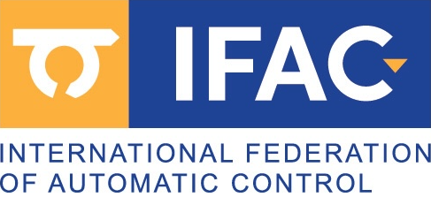

<link rel="stylesheet" href="//maxcdn.bootstrapcdn.com/font-awesome/4.3.0/css/font-awesome.min.css">
<link rel="stylesheet" href="//cdn.rawgit.com/jpswalsh/academicons/master/css/academicons.min.css">
<link rel="stylesheet" href="{{'/assets/css/flickity.css'| relative_url }}">
<link rel="stylesheet" href="{{'/assets/css/csl-blocks.css'| relative_url }}">

# About

<!--<figure style="width: 30%" class="group-photo align-right"></figure>-->
The Nano-Robotics research group at IDSIA focuses its scientific effort on improving the onboard intelligence of ultra-constrained miniaturized robotic platforms aiming at the same capability as biological systems.
By leveraging Artificial Intelligence-based (AI) algorithms, some of the research areas encompass optimized ultra-low power embedded Cyber-Physical Systems (CPS), deep learning models for energy-efficient perception pipelines, multi-modal ultra-low power sensor fusion, Human-Robot Interaction (HRI) applications, and Cyber-secure systems for Microcontroller Units-class (MCUs).

Thanks to the close partnership with the Parallelel Ultra-low Power international research project ([PULP Platform](https://pulp-platform.org/)), the Nano-Robotics group at IDSIA boasts strong collaborations with the ETH Zürich, the University of Bologna, and the Polytechnic University of Torino.

# People



# News

## Feb 25 2025
Two papers from our group accepted at [ICRA 2026](https://2026.ieee-icra.org/):
- "Tiny-DroNeRF: Tiny Neural Radiance Fields aboard Federated Learning-enabled Nano-drones," in collaboration with University of Bologna and ETH Zurich.
- “Self-supervised Domain Adaptation for Visual 3D Pose Estimation of Nano-drone Racing Gates by Enforcing Geometric Consistency,” in collaboration with University of Milan.

## Feb 24 2026

<figure style="width: 20%; gap: 10px; display: flex;" class="align-right">
  
  
  
</figure>

Our group was recently awarded competitive funding for three research projects:

 * **SNSF Project Funding** "RoboMix2: Mixed Event-frame-based On-device Learning on Mixed Spiking-artificial Neural Networks for Robotics" in collaboration with ETH Zurich and University of Bologna with a total budget of CHF 1.6M. 
   The project aims to develop an ultra-low-power neuromorphic computing platform for visual odometry on both ground and aerial miniaturized robots, integrating mixed event-frame sensing, hybrid SNN–ANN processing, and on-device continual TinyML learning through hardware–software co-design.
   [SNSF](https://data.snf.ch/grants/grant/10004854)
 * **EU Interreg project** "ALP-AI" in collaboration with Politecnico di Milano, ARPA Lombardia, Parco Regionale Campo dei Fiori, and the Cantonal Phytosanitary Service of Canton Ticino.
   IDSIA is the Swiss leader in this project which aims to strengthen the protection and preservation of nature, biodiversity, and green infrastructure, including in urban areas, and reduce all forms of pollution.
 * **IFAB project** "ADAPT-AI: Adaptive Edge Intelligence for Complex Environments".
   The project aims to develop a multimodal Edge-AI platform based on architectures characterized by low computational capacity, low energy consumption, and low cost, enabling local processing on sensor nodes deployed in complex environments.

<figure style="width: 10%" class="align-left"></figure>

## Feb 19 2026
Our journal article “Nonlinear System Identification for a Nano-drone Benchmark" has been accepted for publication in the [IFAC Control Engineering Practice](https://www.sciencedirect.com/journal/control-engineering-practice) journal. [arXiv preprint](https://arxiv.org/abs/2512.14450)

<figure style="width: 20%" class="align-right"></figure>

## Dec 01 2025
Our new journal article, “Multi-modal On-Device Learning for Monocular Depth Estimation on Ultra-low-power MCUs," in collaboration with UNIBO, KU Leuven, and ETHZ, has been accepted for publication in the [IEEE Internet of Things Journal](https://ieeexplore.ieee.org/abstract/document/11271766). [arXiv preprint](https://arxiv.org/abs/2512.00086)

<figure style="width: 10%" class="align-left"></figure>

## Feb 02 2025
Our new journal article, “An Efficient Ground-aerial Transportation System for Pest Control Enabled by AI-based Autonomous Nano-UAVs,” has just been accepted for publication in the [ACM Journal on Autonomous Transportation Systems](https://dl.acm.org/journal/jats). [arXiv preprint](https://arxiv.org/abs/2502.14455)

<figure style="width: 10%" class="align-right"></figure>

## Jan 27 2025
Our new paper, “A Map-free Deep Learning-based Framework for Gate-to-Gate Monocular Visual Navigation aboard Miniaturized Aerial Vehicles,” has just been accepted at [IEEE ICRA'25](https://2025.ieee-icra.org/). [arXiv preprint]() [demo-video](https://youtu.be/aY0dIhoKQXg)

<figure style="width: 10%" class="align-left"></figure>

## Jul 11 2024
Our new paper, “Training on the Fly: On-device Self-supervised Learning aboard Nano-drones within 20mW,” has just been accepted for publication in the [IEEE Transactions on Computer-Aided Design of Integrated Circuits and Systems (TCAD)](https://ieee-ceda.org/publications/tcad) and for oral presentation at [CODES+ISSS'24](https://esweek.org/codes-isss/) during the next [ESWEEK](https://esweek.org/). [arXiv preprint](https://arxiv.org/abs/2408.03168)

<figure style="width: 20%" class="align-right"></figure>

## Jul 5 2024
Our new journal article, “Distilling Tiny and Ultra-fast Deep Neural Networks for Autonomous Navigation on Nano-UAVs," in collaboration with UNIBO, TII, and ETHZ, has just been accepted for publication in the [IEEE Internet of Things Journal](https://ieee-iotj.org/). [arXiv preprint](https://arxiv.org/abs/2407.12675)

<figure style="width: 30%" class="align-left"></figure>

## Jun 19 2024
The paper, "Multi-resolution Rescored ByteTrack for Video Object Detection on Ultra-low-power Embedded Systems," coauthored by a UNIBO, IDSIA, KUL, and ETHZ, got the **Best Paper Award** at the 20th [Embedded Vision Workshop](https://embeddedvisionworkshop.wordpress.com/) in conjunction with the CVPR Conference in Seattle, Washington, USA. [CVF open access](https://openaccess.thecvf.com/content/CVPR2024W/EVW/papers/Bompani_Multi-resolution_Rescored_ByteTrack_for_Video_Object_Detection_on_Ultra-low-power_Embedded_CVPRW_2024_paper.pdf)

<figure style="width: 30%" class="align-right"></figure>

## Apr 10 2024
Our new journal article, “Vision-state Fusion: Improving Deep Neural Networks for Autonomous Robotics,” has just been accepted for publication in the [Springer Journal of Intelligent & Robotic Systems](https://link.springer.com/journal/10846). [Springer open access](https://link.springer.com/article/10.1007/s10846-024-02091-6). 

<figure style="width: 15%" class="align-left"></figure>

## Mar 15 2024
Our new paper, “Fusing Multi-sensor Input with State Information on TinyML Brains for Autonomous Nano-drones,” was presented at the [European Robotics Forum 2024](https://erf2024.eu/). [arXiv preprint](https://arxiv.org/pdf/2404.02567.pdf). 

<figure style="width: 30%" class="align-right"></figure>

## Mar 15 2024
Our new paper, “A Deep Learning-based Pest Insect Monitoring System for Ultra-low Power Pocket-sized Drones,” was accepted for publication in the [Wi-DroIT 2024 Workshop](https://widroit2024.github.io/) in conjunction with the [IEEE International Conference on Distributed Computing in Smart Systems and Internet of Things (DCOSS)](https://dcoss.org/). [arXiv preprint](https://arxiv.org/abs/2407.00815)

<figure style="width: 20%" class="align-left"></figure>

## Jan 29, 2024
Two new papers have just been accepted at [IEEE ICRA'24](https://2024.ieee-icra.org/). "On-device Self-supervised Learning of Visual Perception Tasks aboard Hardware-limited Nano-quadrotors," [arXiv preprint](http://arxiv.org/abs/2403.04071) [demo-video](https://youtu.be/blOid4iUFAM) and "High-throughput Visual Nano-drone to Nano-drone Relative Localization using Onboard Fully Convolutional Networks" [arXiv preprint](http://arxiv.org/abs/2402.13756) [demo-video](https://www.youtube.com/watch?v=wMFYnv8UE80).

<figure style="width: 30%" class="align-right"></figure>

## Jan 26, 2024
Our new paper, “Self-Supervised Learning of Visual Robot Localization Using LED State Prediction as a Pretext Task,” has just been accepted for publication in IEEE Robotics and Automation Letters (RA-L) [arXiv preprint](https://arxiv.org/abs/2402.09886) [repository](https://github.com/idsia-robotics/leds-as-pretext).

<figure style="width: 12%" class="align-left"></figure>

## Jan 19, 2024
We contributed to the novel paper "A Heterogeneous RISC-V based SoC for Secure Nano-UAV Navigation," which was just accepted at the [IEEE Transactions on Circuits and Systems I (TCAS-I)](https://ieee-cas.org/publication/TCAS-I). [arXiv preprint](https://arxiv.org/abs/2401.03531).

<figure style="width: 20%" class="align-right"></figure>

## Dec 18, 2023
Our new paper, "Adaptive Deep Learning for Efficient Visual Pose Estimation aboard Ultra-low-power Nano-drones," in collaboration with POLITO, has just been accepted at [ACM Design, Automation and Test in Europe Conference (DATE'24)](https://www.date-conference.com/). [arXiv preprint](https://arxiv.org/abs/2401.15236).

<figure style="width: 30%" class="align-left"></figure>

## Dec 15, 2023
Our new paper, “A Sim-to-Real Deep Learning-based Framework for Autonomous Nano-drone Racing,” has just been accepted for publication in IEEE Robotics and Automation Letters (RA-L) [arXiv preprint](https://arxiv.org/abs/2312.08991) [video](https://youtu.be/vHTAwUsj-nk).
This work describes our autonomous navigation and obstacle avoidance system for palm-sized quadrotors, developed in collaboration with Università di Bologna and TII Abu Dhabi and winner of the 1st Nanocopter AI Challenge at [IMAV 2022, Delft, Netherlands](https://www.imavs.org/2022/index.html).

<figure style="width: 30%" class="align-right"></figure>

## Sep 25, 2023
Our new paper, “Secure Deep Learning-based Distributed Intelligence on Pocket-sized Drones,” received the **Best Paper Award** at the 2nd Workshop on Security and Privacy in Connected Embedded Systems (SPICES) during the [ACM EWSN’23 conference](https://www.ewsn.org/) in Rende, Italy.
Our work proposes a secure computational paradigm for deep learning workloads that allows resource-constrained devices, such as nano-drones, to take advantage of powerful remote computation nodes while preserving security against external attackers.

## Jun 29, 2023
Our new paper, "Secure Deep Learning-based Distributed Intelligence on Pocket-sized Drones," has just been accepted at [ACM EWSN'23](https://events.dimes.unical.it/ewsn2023/). [arXiv preprint](https://arxiv.org/abs/2307.01559) [demo-video](https://youtu.be/QwTiigAs4cA).

<figure style="width: 30%" class="align-left"></figure>

## Jun 21, 2023
Our new paper, "Sim-to-Real Vision-depth Fusion CNNs for Robust Pose Estimation Aboard Autonomous Nano-quadcopters," has just been accepted at [IEEE IROS'23](https://ieee-iros.org/). [arXiv preprint](https://arxiv.org/abs/2308.01833) [demo-video](https://youtu.be/p4s2j0_6828).

<figure style="width: 30%" class="align-right"></figure>

## May 4, 2023
We contributed to the novel paper "Shaheen: An Open, Secure, and Scalable RV64 SoC for Autonomous Nano-UAVs," just accepted at [HotChips'23](https://hotchips.org/).

<figure style="width: 30%" class="align-left"></figure>

## Jan 20, 2023
We contributed to the novel paper "Cyber Security aboard Micro Aerial Vehicles: An OpenTitan-based Visual Communication Use Case," just accepted at [IEEE ISCAS'23](https://iscas2023.org/). [arXiv preprint](https://arxiv.org/abs/2303.16554) [demo-video](https://youtu.be/TClcuUWJe0U).

<figure style="width: 30%" class="align-right"></figure>

## Jan 17, 2023
Two new papers have just been accepted at [IEEE ICRA'23](https://www.icra2023.org/). "Deep Neural Network Architecture Search for Accurate Visual Pose Estimation aboard Nano-UAVs," [arXiv preprint](https://arxiv.org/abs/2303.01931) [demo-video](https://youtu.be/dVCScckvcg8) and "Ultra-low Power Deep Learning-based Monocular Relative Localization Onboard Nano-quadrotors" [arXiv preprint](https://arxiv.org/abs/2303.01940) [demo-video](https://youtu.be/pUGL1qu3Z1k).
